# SalonSupply — Functional Specification Document (FSD)

| Field | Value |
|-------|--------|
| **Project** | SalonSupply |
| **Document type** | Functional Specification Document (FSD) |
| **Version** | 1.0 |
| **Status** | Current build (as implemented) |
| **Audience** | Product, QA, developers, stakeholders |
| **Companion docs** | [SIMPLE_ROLE_FLOWS.md](./SIMPLE_ROLE_FLOWS.md) — **simple language, each role workflow** · [USER_GUIDE.md](./USER_GUIDE.md) — detailed user manual |

---

> **Want simple language only?** Read **[SIMPLE_ROLE_FLOWS.md](./SIMPLE_ROLE_FLOWS.md)** — same current flows without technical detail.

---

## Table of contents

1. [Purpose & scope](#1-purpose--scope)
2. [System overview](#2-system-overview)
3. [Actors & roles](#3-actors--roles)
4. [Technology & deployment](#4-technology--deployment)
5. [Data model summary](#5-data-model-summary)
6. [Global business flows](#6-global-business-flows)
7. [Role access matrix](#7-role-access-matrix)
8. [Module specifications](#8-module-specifications)
9. [Role flows (detailed)](#9-role-flows-detailed)
   - [9.1 Super Admin](#91-super-admin-flow)
   - [9.2 Distributor](#92-distributor-flow)
   - [9.3 Salesman](#93-salesman-flow)
   - [9.4 Salon](#94-salon-flow)
10. [Order lifecycle](#10-order-lifecycle)
11. [Payment lifecycle (offline)](#11-payment-lifecycle-offline)
12. [API reference summary](#12-api-reference-summary)
13. [UI pages by role](#13-ui-pages-by-role)
14. [Business rules & validations](#14-business-rules--validations)
15. [Known limitations & future scope](#15-known-limitations--future-scope)

---

## 1. Purpose & scope

### 1.1 Purpose

SalonSupply is a **B2B salon supply management platform**. It connects:

- **Distributors** (wholesalers) who stock and sell products
- **Salons** (retail customers) who order supplies
- **Salesmen** (field staff) who support salons and collect payments
- **Super Admins** who oversee the platform

The system supports **catalog management**, **ordering**, **delivery tracking**, and **offline payment recording** (cash / UPI / bank — manual confirmation, no payment gateway integration).

### 1.2 In scope (current version)

| Area | Included |
|------|----------|
| Authentication | Email + password, JWT |
| Products | CRUD, brands, categories, stock, image URL |
| Orders | Place, approve, track, cancel (rules apply) |
| Salons | CRUD (distributor), list (salesman) |
| Salesmen | CRUD, view routes (territory salons) |
| Payments | Record offline payments, history, summaries |
| Currency | Indian Rupee (INR) display |

### 1.3 Out of scope (current version)

- Online payment gateway (Razorpay, Stripe, etc.)
- Automatic UPI verification
- Image file upload (URL only)
- SMS / email notifications (table exists, not wired in UI)
- Salon self-registration
- Per-salesman salon assignment (salesman sees all distributor orders)

---

## 2. System overview

### 2.1 High-level architecture

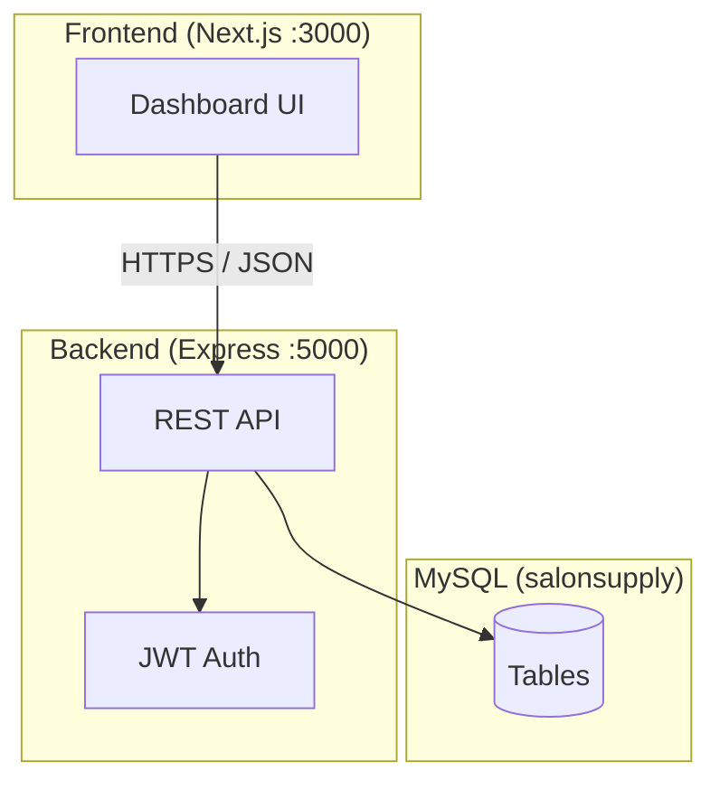

### 2.2 Request flow (authenticated)

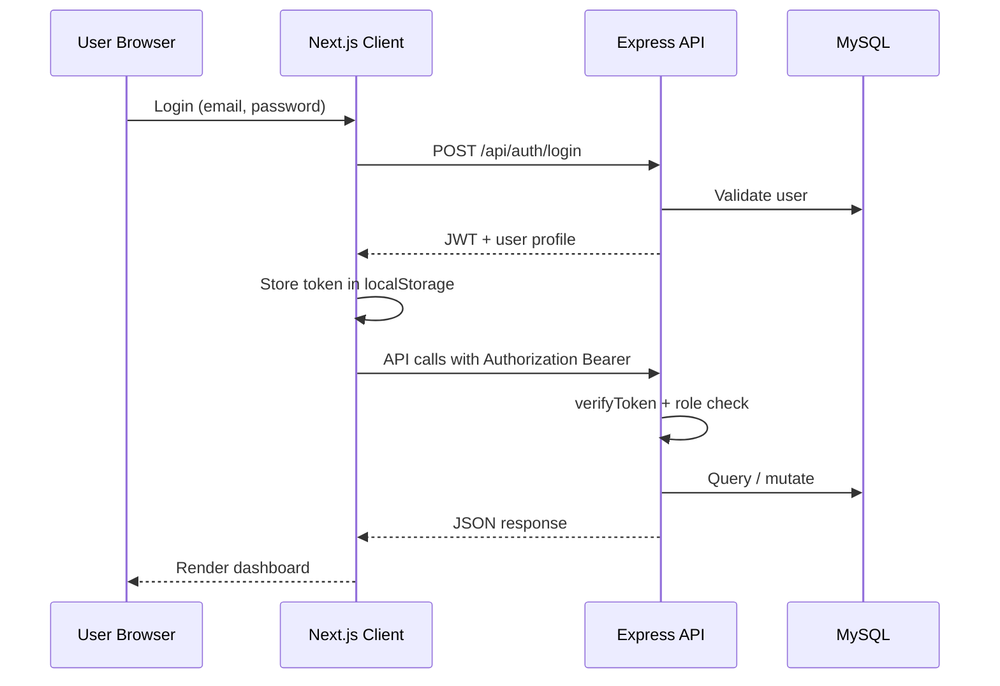

---

## 3. Actors & roles

| Actor | System role | Description |
|-------|-------------|-------------|
| **Super Admin** | `super_admin` | Platform administrator; full visibility and management |
| **Distributor** | `distributor` | Owns product catalog, salons, salesmen; approves orders; records payments |
| **Salesman** | `salesman` | Field rep under one distributor; views territory orders/salons; records payments |
| **Salon** | `salon` | End customer; browses catalog, places orders, tracks delivery |

### 3.1 Demo accounts

| Role | Email | Password |
|------|-------|----------|
| Super Admin | admin@salonsupply.com | password123 |
| Distributor | john@example.com | password123 |
| Salesman | salesman@example.com | password123 |
| Salon | salon@example.com | password123 |

---

## 4. Technology & deployment

| Layer | Technology | Location |
|-------|------------|----------|
| Frontend | Next.js, React, Tailwind, Framer Motion | `client/` |
| Backend | Node.js, Express | `server/` |
| Database | MySQL | XAMPP / local |
| Auth | JWT (24h), bcrypt passwords | `server/src/middleware` |

### 4.1 Run locally

```bash
# Terminal 1 — API
cd server && npm run dev    # http://localhost:5000

# Terminal 2 — UI
cd client && npm run dev    # http://localhost:3000
```

### 4.2 Key URLs

| Page | URL |
|------|-----|
| Login | http://localhost:3000/login |
| Dashboard | http://localhost:3000/dashboard |
| Products | http://localhost:3000/dashboard/products |
| Orders | http://localhost:3000/dashboard/orders |
| Salons | http://localhost:3000/dashboard/salons |
| Salesmen | http://localhost:3000/dashboard/salesmen |
| Payments | http://localhost:3000/dashboard/payments |

---

## 5. Data model summary

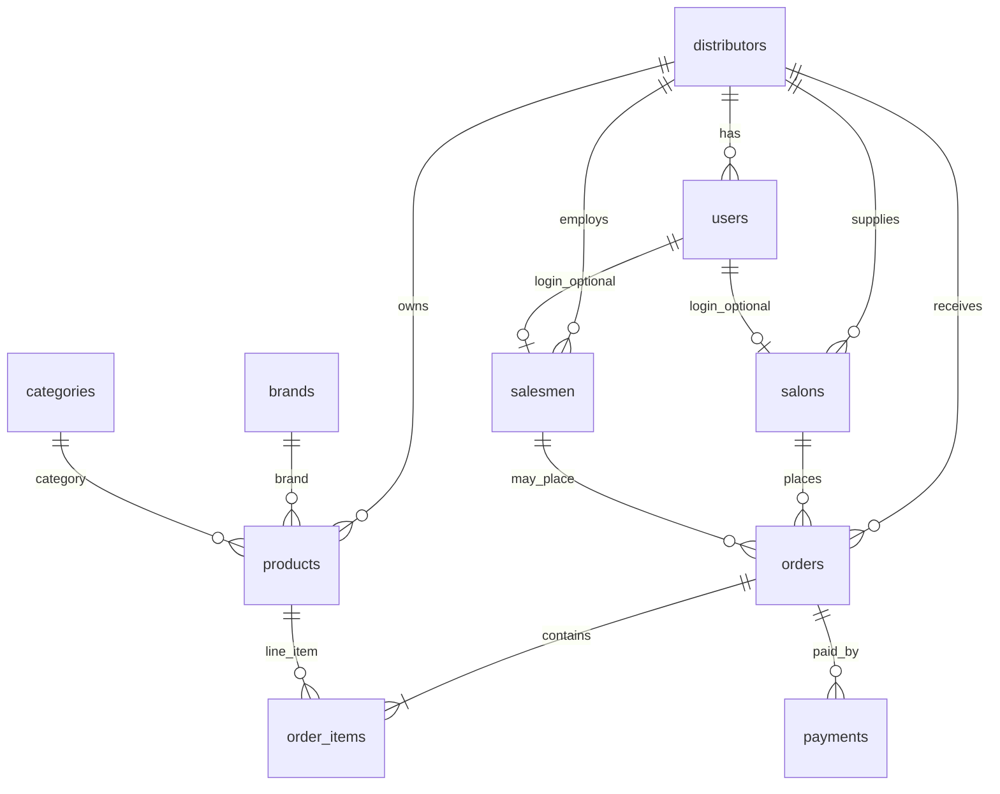

### 5.1 Core entities

| Entity | Purpose |
|--------|---------|
| `distributors` | Wholesale business profile |
| `users` | Login accounts with `role` and optional `distributor_id` |
| `salons` | Customer parlours linked to a distributor |
| `salesmen` | Field reps linked to a distributor |
| `brands` | Product brands (global catalog) |
| `categories` | Product categories (global catalog) |
| `products` | Items for sale; scoped by `distributor_id` |
| `orders` | Supply orders with delivery + payment status |
| `order_items` | Line items per order |
| `payments` | Offline payment records per order |

---

## 6. Global business flows

### 6.1 End-to-end supply chain

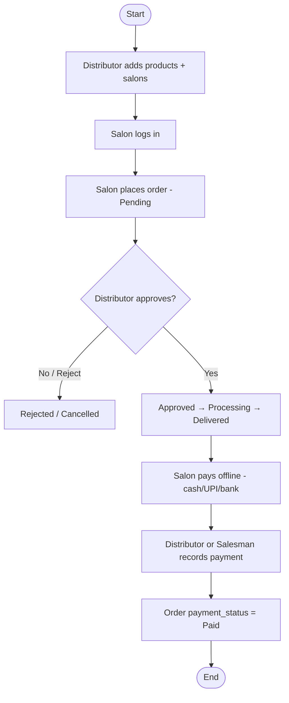

### 6.2 Who touches what

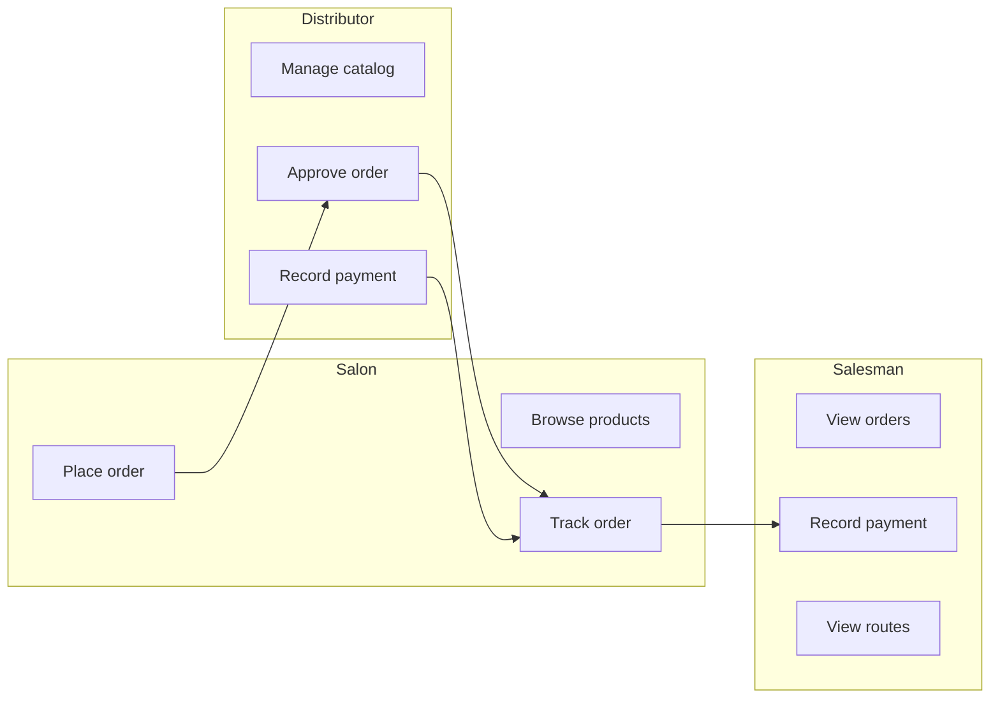

---

## 7. Role access matrix

### 7.1 Navigation (sidebar)

| Module | Super Admin | Distributor | Salesman | Salon |
|--------|:-----------:|:-------------:|:--------:|:-----:|
| Dashboard | ✓ | ✓ | ✓ | ✓ |
| Products | ✓ | ✓ | — | ✓ |
| Orders | ✓ | ✓ | ✓ | ✓ |
| Salons | ✓ | ✓ | ✓ | — |
| Salesmen | ✓ | ✓ | — | — |
| Payments | ✓ | ✓ | ✓ | — |

### 7.2 Actions (functional)

| Action | Super Admin | Distributor | Salesman | Salon |
|--------|:-----------:|:-------------:|:--------:|:-----:|
| Create / edit / delete product | ✓ | ✓ | — | — |
| Create brand / category | ✓ | ✓ | — | — |
| Browse products | ✓ | ✓ | — | ✓ |
| Place order (self) | ✓ | — | — | ✓ |
| Place order (for salon) | ✓ | ✓ | ✓* | — |
| View orders | All | Own distributor | Own distributor | Own salon |
| Update order status | ✓ | ✓ | — | — |
| Cancel pending order | ✓ | ✓ | — | ✓ |
| Add salon | ✓ | ✓ | — | — |
| Add salesman | ✓ | ✓ | — | — |
| View salesman routes | ✓ | ✓ | — | — |
| Record payment | ✓ | ✓ | ✓ | — |
| View payment history | ✓ | ✓ | ✓ | — |

\* Salesman must provide `salon_id`; order tagged with `salesman_id`.

---

## 8. Module specifications

### 8.1 Authentication

| ID | Requirement |
|----|-------------|
| AUTH-01 | User logs in with email and password |
| AUTH-02 | System returns JWT valid 24 hours |
| AUTH-03 | Unauthenticated users redirect to `/login` |
| AUTH-04 | Role stored in JWT and user object in `localStorage` |

### 8.2 Products & catalog

| ID | Requirement |
|----|-------------|
| PRD-01 | Distributor/Super Admin can create, edit, delete products |
| PRD-02 | Product fields: name, description, price, stock, SKU, image URL, brand, category |
| PRD-03 | Salon sees only products from their linked distributor |
| PRD-04 | Brand/category created from product modal (type name + Add, or auto on Save) |
| PRD-05 | Duplicate brand/category names reuse existing record (case-insensitive) |
| PRD-06 | Product card shows `BRAND · CATEGORY` (fallback: No brand / Uncategorized) |

### 8.3 Orders

| ID | Requirement |
|----|-------------|
| ORD-01 | Salon order auto-links to salon profile via `user_id` |
| ORD-02 | Order number auto-generated: `ORD-{timestamp}-{random}` |
| ORD-03 | Stock deducted on place; restored on cancel (pending only) |
| ORD-04 | Orders list shows Delivery status, Payment status, Track stepper |
| ORD-05 | Distributor filters orders by `?salon_id=` from Salons page |

### 8.4 Salons

| ID | Requirement |
|----|-------------|
| SLN-01 | Distributor creates salon (name, owner, phone, address) |
| SLN-02 | View History → orders filtered by salon |
| SLN-03 | Create Order → distributor places order for salon from modal |

### 8.5 Salesmen

| ID | Requirement |
|----|-------------|
| SLM-01 | Distributor/Super Admin adds salesman (name, phone) |
| SLM-02 | View Routes → list salons in salesman’s distributor territory |
| SLM-03 | Jump to salon orders from route modal |

### 8.6 Payments

| ID | Requirement |
|----|-------------|
| PAY-01 | Offline payment: manual confirmation only |
| PAY-02 | Methods: cash, upi, bank_transfer |
| PAY-03 | Optional reference (UPI UTR) and notes stored |
| PAY-04 | Cannot record payment on Pending or Rejected orders |
| PAY-05 | Partial payments supported; `payment_status` = partial until full |
| PAY-06 | Queue split: `ready_to_collect` vs `awaiting_approval` |

---

## 9. Role flows (detailed)

---

### 9.1 Super Admin flow

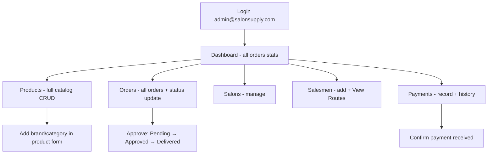

#### Step-by-step

| Step | Action | Screen | Result |
|------|--------|--------|--------|
| 1 | Login | `/login` | JWT issued, role `super_admin` |
| 2 | Review network | Dashboard | Aggregated order stats |
| 3 | Manage catalog | Products → Add/Edit | Products, brands, categories updated |
| 4 | Oversee orders | Orders → eye icon | View tracking + payment |
| 5 | Change delivery | Order modal → status buttons | Status updated |
| 6 | Manage salons | Salons | Create salon, view history |
| 7 | Manage reps | Salesmen → View Routes | Territory salon list |
| 8 | Record collections | Payments → Confirm payment | Payment row + Paid status |

**Data scope:** All distributors (no `distributor_id` filter on reads unless implemented per endpoint).

---

### 9.2 Distributor flow

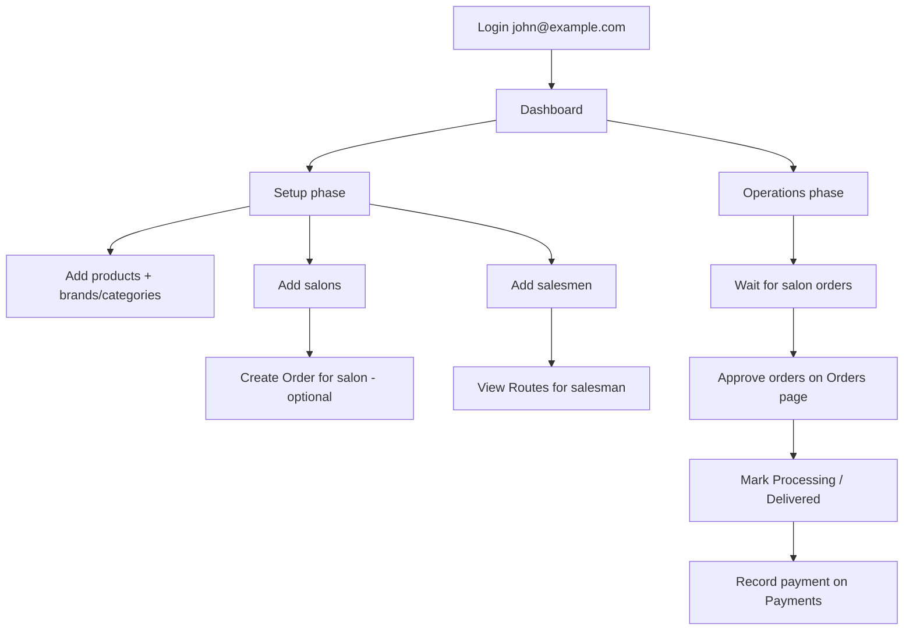

#### Step-by-step

| Phase | Step | Action | Result |
|-------|------|--------|--------|
| **Setup** | 1 | Products → Add Product | Catalog live for salons |
| | 2 | In form: new brand/category → Add or Save | Brand/category in DB |
| | 3 | Salons → Add Salon | Salon linked to distributor |
| | 4 | Salesmen → Add Salesman | Field rep profile created |
| **Daily** | 5 | Orders → Pending items | Review new salon orders |
| | 6 | Open order → Approved | Salon sees “Confirmed” on track |
| | 7 | Processing → Delivered | Delivery track complete |
| | 8 | Payments → Confirm payment | Order marked Paid |
| **Optional** | 9 | Salons → Create Order | Order placed on behalf of salon |
| | 10 | Salesmen → View Routes | Plan field visits |

**Data scope:** `distributor_id` from logged-in user.

---

### 9.3 Salesman flow

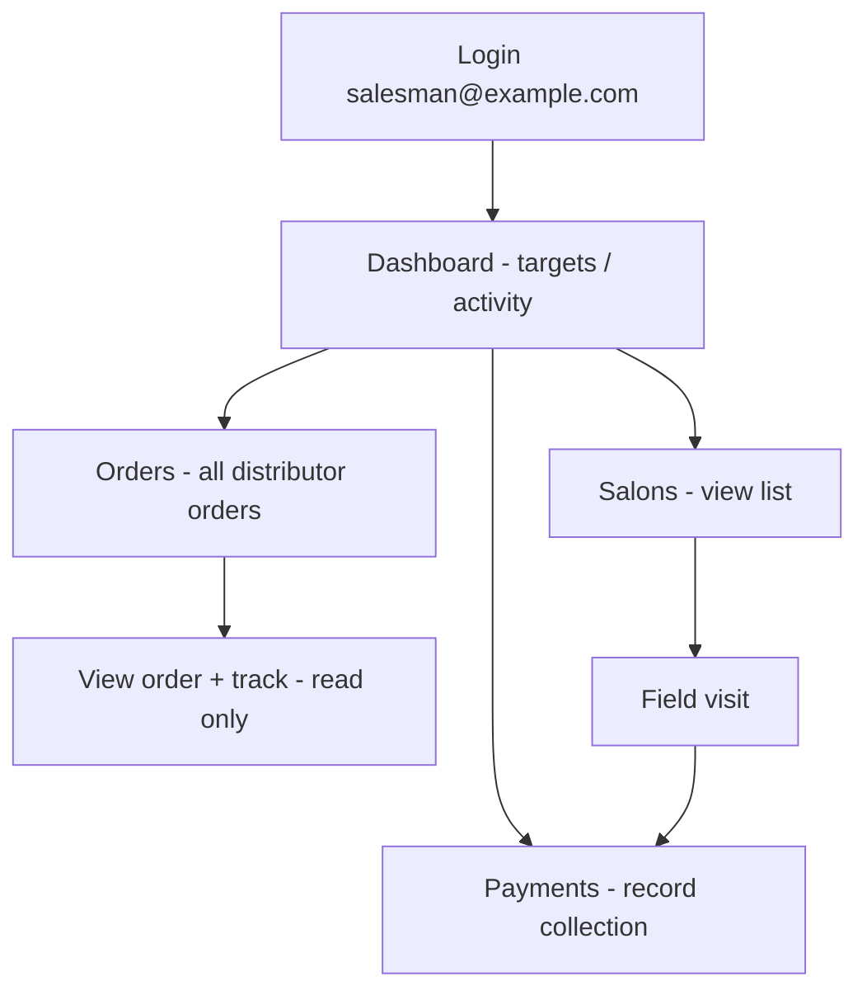

#### Step-by-step

| Step | Action | Screen | Result |
|------|--------|--------|--------|
| 1 | Login | `/login` | Territory = distributor’s `distributor_id` |
| 2 | Check salons | Salons | List of parlours to visit |
| 3 | Check orders | Orders | All orders for distributor (incl. salon self-orders) |
| 4 | View details | Orders → eye | Track + payment status (no status edit) |
| 5 | Collect money offline | Field | Cash/UPI from salon |
| 6 | Record in app | Payments → Confirm payment | Payment saved, order Paid/Partial |
| 7 | Verify history | Payments → Payment history | Audit trail |

**Cannot:** Approve orders, edit products, add salons/salesmen.

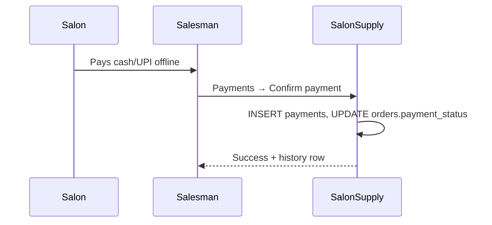

---

### 9.4 Salon flow

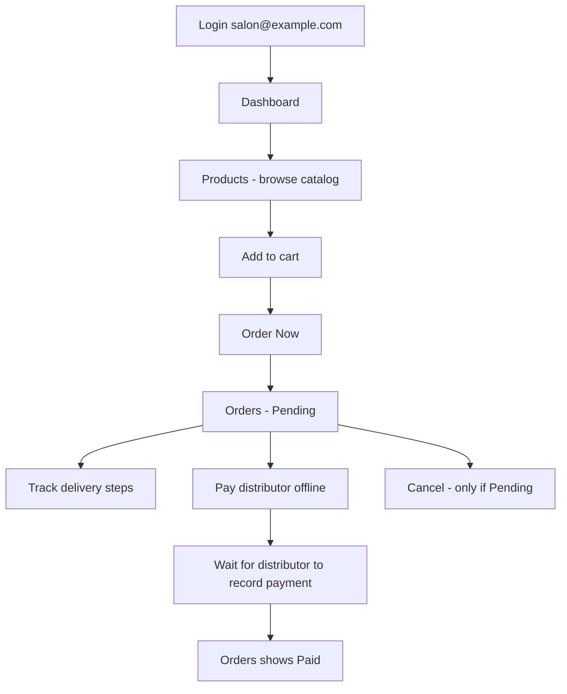

#### Step-by-step

| Step | Action | Screen | Result |
|------|--------|--------|--------|
| 1 | Login | `/login` | Linked via `salons.user_id` |
| 2 | Browse | Products | Distributor’s products only |
| 3 | Add to cart | Products | Cart count updated |
| 4 | Place order | Order Now modal | Order `pending`, stock reduced |
| 5 | Track | Orders | Delivery + Payment + Track columns |
| 6 | Cancel (optional) | Orders → trash (pending only) | Order deleted, stock restored |
| 7 | Pay offline | Real world | Outside app |
| 8 | See Paid | Orders | After distributor/salesman records payment |

**Cannot:** Record payments, approve orders, manage catalog.

---

## 10. Order lifecycle

### 10.1 Status state machine

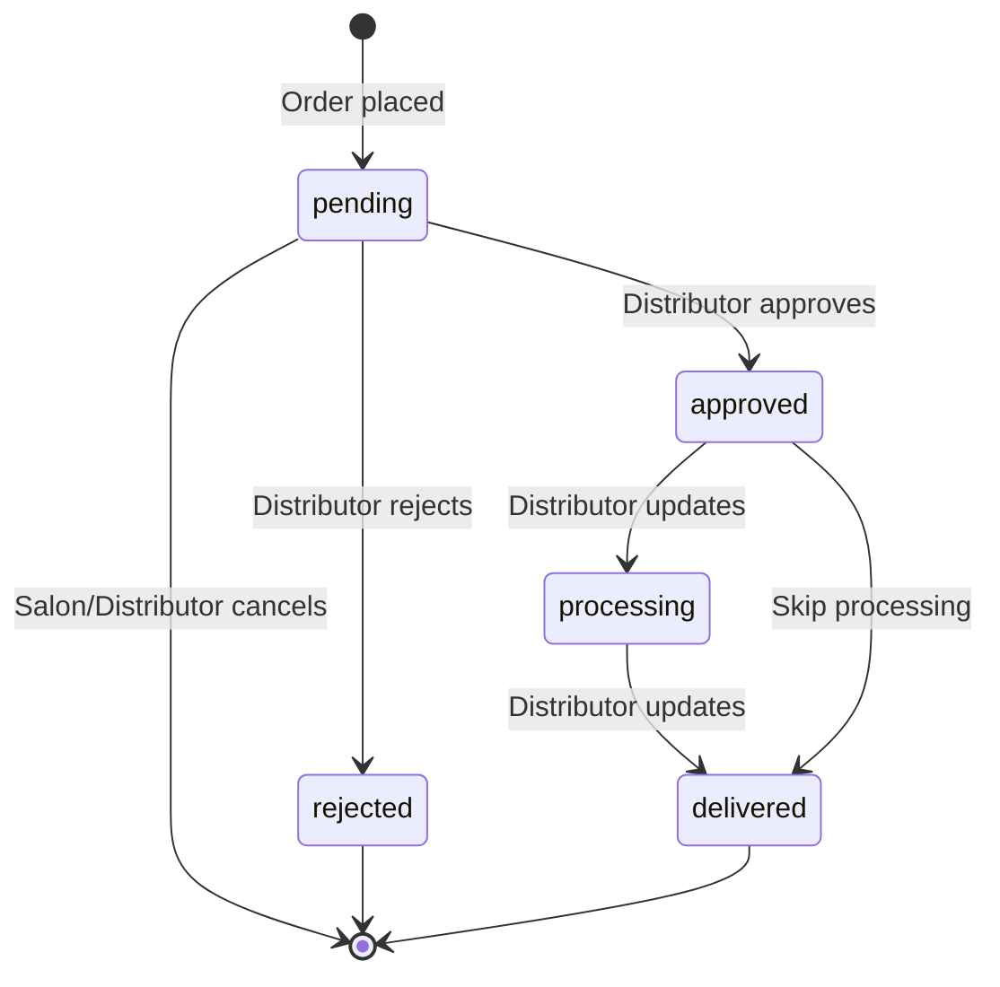

### 10.2 Tracking UI (5 steps)

| Step | Label | When active |
|------|-------|-------------|
| 1 | Order placed | `status = pending` or higher |
| 2 | Confirmed | `approved`, `processing`, `delivered` |
| 3 | Out for delivery | `processing`, `delivered` |
| 4 | Delivered | `delivered` |
| 5 | Payment collected | `payment_status = paid` |

### 10.3 Permissions

| Action | Roles |
|--------|-------|
| Create order | salon, salesman, distributor, super_admin |
| Update status | distributor, super_admin |
| Cancel | salon (pending only), distributor, super_admin |
| View | all authenticated (scoped by role) |

---

## 11. Payment lifecycle (offline)

### 11.1 Concept

> **Payment success = human confirmation in the app after money is received in real life.**

No bank API. Optional UPI reference stored as proof.

### 11.2 Payment state machine

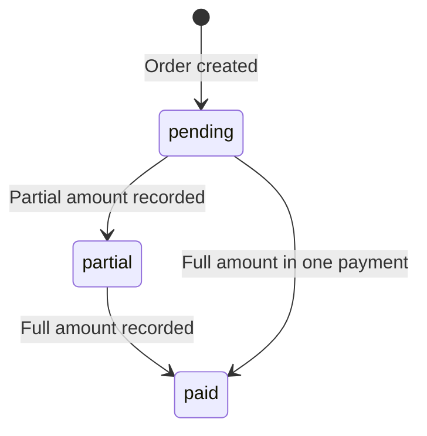

### 11.3 Record payment flow

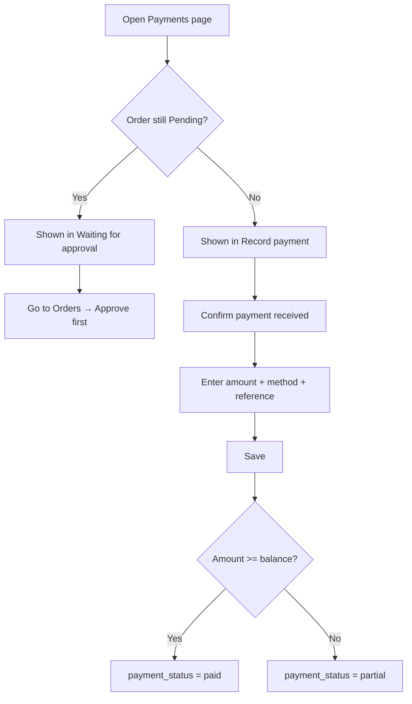

### 11.4 Who can record

| Role | Allowed |
|------|---------|
| Distributor | ✓ (own distributor orders) |
| Salesman | ✓ (same distributor territory) |
| Super Admin | ✓ |
| Salon | ✗ (view only via order payment column) |

---

## 12. API reference summary

Base URL: `http://localhost:5000/api`

| Method | Endpoint | Roles | Purpose |
|--------|----------|-------|---------|
| POST | `/auth/login` | Public | Login |
| POST | `/auth/register` | Public | Register user |
| GET | `/products` | All auth | List products (scoped) |
| POST | `/products` | distributor, super_admin | Create product |
| PUT | `/products/:id` | distributor, super_admin | Update product |
| DELETE | `/products/:id` | distributor, super_admin | Delete product |
| GET | `/catalog/brands` | All auth | List brands |
| POST | `/catalog/brands` | distributor, super_admin | Create brand |
| GET | `/catalog/categories` | All auth | List categories |
| POST | `/catalog/categories` | distributor, super_admin | Create category |
| GET | `/orders` | All auth | List orders (scoped) |
| POST | `/orders` | salon, salesman, distributor, super_admin | Place order |
| GET | `/orders/:id` | All auth | Order detail + payments |
| PUT | `/orders/:id/status` | distributor, super_admin | Update delivery status |
| DELETE | `/orders/:id` | salon, distributor, super_admin | Cancel pending |
| GET | `/salons` | All auth | List salons (scoped) |
| GET | `/salons/me` | salon | Own salon profile |
| POST | `/salons` | distributor, super_admin | Create salon |
| GET | `/salesmen` | All auth | List salesmen (scoped) |
| POST | `/salesmen` | distributor, super_admin | Create salesman |
| GET | `/salesmen/:id/routes` | distributor, super_admin | Territory salons |
| GET | `/payments/summary` | All auth | Totals (scoped) |
| GET | `/payments` | All auth | Payment history |
| GET | `/payments/unpaid-orders` | distributor, salesman, super_admin | Payment queue |
| POST | `/payments` | distributor, salesman, super_admin | Record payment |

**Auth header:** `Authorization: Bearer <token>`

---

## 13. UI pages by role

| Page | Path | Super Admin | Distributor | Salesman | Salon |
|------|------|-------------|-------------|----------|-------|
| Login | `/login` | ✓ | ✓ | ✓ | ✓ |
| Dashboard | `/dashboard` | ✓ | ✓ | ✓ | ✓ |
| Products | `/dashboard/products` | Manage + view | Manage + view | — | Browse + order |
| Orders | `/dashboard/orders` | All + edit status | Scoped + edit | Scoped read | Own + cancel |
| Salons | `/dashboard/salons` | ✓ | ✓ | View | — |
| Salesmen | `/dashboard/salesmen` | ✓ | ✓ | — | — |
| Payments | `/dashboard/payments` | ✓ | ✓ | ✓ | — |

---

## 14. Business rules & validations

| Rule | Description |
|------|-------------|
| BR-01 | Salon user must have row in `salons` linked by `user_id` to place orders |
| BR-02 | Order placement checks stock; insufficient stock returns error |
| BR-03 | Only `pending` orders can be cancelled by salon |
| BR-04 | Cancel restores product stock and deletes order |
| BR-05 | Payment recording blocked if order `status = pending` or `rejected` |
| BR-06 | Payment amount cannot exceed remaining balance |
| BR-07 | Salesman sees orders where `orders.distributor_id` = their distributor |
| BR-08 | Salesman-placed orders set `salesman_id` automatically |
| BR-09 | Salon-placed orders have `salesman_id = NULL` but visible to salesman via distributor |
| BR-10 | Brand/category names deduplicated case-insensitively on create |
| BR-11 | Product display uses middle dot separator between brand and category |

---

## 15. Known limitations & future scope

| # | Limitation | Possible future |
|---|------------|-----------------|
| 1 | No payment gateway | Razorpay / PhonePe integration |
| 2 | Image URL only | File upload to S3 / local storage |
| 3 | No salesman–salon assignment | Assign salons per rep for routes |
| 4 | Super Admin product create uses first distributor if no `distributor_id` | Explicit distributor picker |
| 5 | Notifications table unused | Push / email on order status |
| 6 | Filter Status button on Orders | Functional status filter |
| 7 | Hardcoded target/achieved on salesman cards | Real sales targets from DB |

---

## Document history

| Version | Date | Author | Changes |
|---------|------|--------|---------|
| 1.0 | May 2026 | SalonSupply team | Initial FSD — current implemented features |

---

*For day-to-day usage instructions, see [USER_GUIDE.md](./USER_GUIDE.md).*
