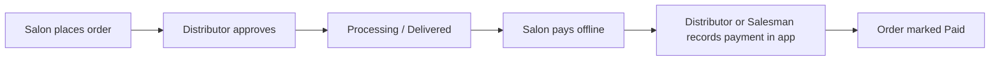

# SalonSupply — Full User Guide (Start to Current Features)

**Simple language · Step by step · All roles**

This document explains what SalonSupply is, how to run it, and how each person (role) uses the system from login to payment.

---

## 1. What is SalonSupply?

SalonSupply is a **B2B supply app** for the salon business:

- A **Distributor** sells products (shampoo, colour, tools, etc.) to many **Salons**.
- A **Salesman** works for the distributor and visits salons in the field.
- A **Salon** logs in and orders products online.
- A **Super Admin** can see and manage everything across distributors.

**Money flow (offline):** Salons pay the distributor in **cash, UPI, or bank transfer** in real life. Inside the app, the distributor or salesman **manually confirms** when payment is received. There is no automatic payment gateway (no Razorpay hook-up in this version).

---

## 2. How to start the app

| Part | URL | How to run |
|------|-----|------------|
| Website (frontend) | http://localhost:3000 | In folder `client`: `npm run dev` |
| API (backend) | http://localhost:5000 | In folder `server`: `npm run dev` |
| Database | MySQL (XAMPP) | Database name: `salonsupply` |

**Login page:** http://localhost:3000/login

After login you go to **Dashboard** automatically.

---

## 3. The four roles (who does what?)

| Role | Who is this? | Main job in the app |
|------|----------------|---------------------|
| **Super Admin** | Company owner / platform admin | See all data; manage products, orders, salons, salesmen, payments |
| **Distributor** | Wholesale supplier (e.g. John Doe) | Manage product catalog, salons, salesmen; approve orders; record payments |
| **Salesman** | Field rep (e.g. Mike Salesman) | See salons & orders in their territory; visit routes; record payments when salon pays |
| **Salon** | Beauty parlour customer (e.g. Royal Beauty Salon) | Browse products, place orders, track delivery; pay distributor offline |

---

## 4. Demo login accounts (for testing)

| Role | Email | Password |
|------|-------|----------|
| Super Admin | admin@salonsupply.com | password123 |
| Distributor | john@example.com | password123 |
| Salesman | salesman@example.com | password123 |
| Salon | salon@example.com | password123 |

---

## 5. Menu each role sees (sidebar)

| Menu item | Super Admin | Distributor | Salesman | Salon |
|-----------|:-----------:|:-------------:|:--------:|:-----:|
| Dashboard | Yes | Yes | Yes | Yes |
| Products | Yes | Yes | No | Yes |
| Orders | Yes | Yes | Yes | Yes |
| Salons | Yes | Yes | Yes | No |
| Salesmen | Yes | Yes | No | No |
| Payments | Yes | Yes | Yes | No |

---

## 6. Full business flow (big picture)

**Order tracking (5 steps shown on Orders page):**

1. **Order placed** — Salon (or distributor/salesman) created the order; status = Pending  
2. **Confirmed** — Distributor approved; status = Approved  
3. **Out for delivery** — status = Processing  
4. **Delivered** — status = Delivered  
5. **Payment collected** — Someone recorded payment; payment status = Paid  

---

## 7. Order statuses (delivery)

| Status | Meaning |
|--------|---------|
| **Pending** | New order; waiting for distributor to approve |
| **Approved** | Distributor accepted the order |
| **Processing** | Order is being prepared / shipped |
| **Delivered** | Goods reached the salon |
| **Rejected** | Distributor cancelled the order |

**Who can change status?** Only **Distributor** and **Super Admin** (on Orders → open order → Update Order Status).

**Who can cancel?** **Salon** can cancel only while status is **Pending**. Distributor / Super Admin can also cancel pending orders.

---

## 8. Payment statuses (money)

| Payment status | Meaning |
|----------------|---------|
| **Unpaid (pending)** | No payment recorded yet |
| **Partial** | Some money recorded, balance still due |
| **Paid** | Full amount recorded in the app |

**Important:** Payment can only be recorded **after** the order is **not Pending** (must be Approved, Processing, or Delivered). If you only see “Waiting for order approval” on Payments, go to **Orders** and approve the order first.

---

# Role guides (step by step)

---

## 9. SALON — Step by step

### Step 1 — Login
1. Open http://localhost:3000/login  
2. Email: `salon@example.com`  
3. Password: `password123`  
4. You land on **Salon Dashboard**.

### Step 2 — Order products
1. Click **Products** (or “Order Supplies” on dashboard).  
2. Browse products from your linked distributor.  
3. Add items to cart (quantity).  
4. Click **Order Now**.  
5. Confirm in the popup → order is created with status **Pending**.

### Step 3 — Track your order
1. Go to **Orders**.  
2. You see columns: **Delivery** (order status), **Payment** (Unpaid/Paid), **Track** (small progress steps).  
3. Click the **eye icon** to open full details and the **Track order** timeline.

### Step 4 — Cancel (only if still pending)
1. On **Orders**, if status is **Pending**, use the **trash** icon or Cancel in the detail popup.  
2. Stock is returned to the distributor.

### Step 5 — Pay the distributor (offline)
1. Pay in **cash / UPI / bank** to your distributor (not inside the app).  
2. Wait until distributor marks order as delivered and records payment.  
3. On **Orders**, **Payment** column will show **Paid** when they confirm in the app.

**Salon cannot:** manage products, record payments, approve orders, or see other salons.

---

## 10. DISTRIBUTOR — Step by step

### Step 1 — Login
1. `john@example.com` / `password123`  
2. **Distributor Dashboard** opens.

### Step 2 — Manage products
1. **Products** → see your catalog.  
2. **Add Product** — name, price, stock, brand, category, image URL.  
3. **Edit** / **Delete** on each card.  
4. **Add brand / category** (distributor and super admin only):
   - Open **Add Product** or **Edit** on a product.
   - Type a new name under **Brand** or **Category** and click **Add**, or click **Save** (creates automatically).
   - Pick the new name from the dropdown if needed, then **Save** the product.
   - Product cards show: `BRAND NAME · CATEGORY` (e.g. `LOREAL · SHAMPOO`). If no category is set, you see `Uncategorized`.

### Step 3 — Manage salons
1. **Salons** → list of salons under you.  
2. **Add Salon** — name, owner, phone, address.  
3. **View History** → opens **Orders** filtered for that salon.  
4. **Create Order** → place an order on behalf of a salon (pick products in modal).

### Step 4 — Manage salesmen
1. **Salesmen** → list field reps.  
2. **Add Salesman** — name and phone (creates salesman profile).  
3. **View Routes** → popup lists all salons in that salesman’s territory (same distributor).  
4. **Orders** button on a salon → order history for that salon.

### Step 5 — Handle orders
1. **Orders** → all orders from your salons.  
2. Open order (eye icon).  
3. **Update Order Status:** Pending → **Approved** → **Processing** → **Delivered** (or Rejected).  
4. Salon sees updated **Track** progress.

### Step 6 — Record payments (offline collection)
1. Salon pays you in real life (cash/UPI/bank).  
2. Go to **Payments**.  
3. Read the blue info box (how offline payment works).  
4. Under **Record payment**, find the order (only appears after order is approved+).  
5. Click **Confirm payment received**.  
6. Enter: amount, method (Cash / UPI / Bank), optional UPI reference, notes.  
7. Click **Mark as paid — confirm received**.  
8. Check **Payment history** and **Total Collected** at the top.

### Step 7 — Dashboard
- See revenue-style stats and recent orders (from your orders list).

**Distributor cannot:** log in as another distributor’s salons (only their `distributor_id` data).

---

## 11. SALESMAN — Step by step

### Step 1 — Login
1. `salesman@example.com` / `password123`  
2. **Salesman Dashboard** (targets, route plan sample, recent activity).

### Step 2 — See orders in your territory
1. **Orders** → all orders for your distributor (including orders salons placed themselves).  
2. Columns: Salon name, Delivery, Payment, Track.  
3. You **cannot** change order status (only distributor approves).

### Step 3 — Visit salons
1. **Salons** → list of salons under your distributor.  
2. Use this on field visits to see who to call on.

### Step 4 — Place order for a salon (optional)
1. Distributor can create orders from **Salons** page.  
2. If salesman places via API: order is linked to salesman when that flow is used from salon with `salon_id`.

### Step 5 — Record payment when salon pays you
1. Salon gives cash/UPI to you in the field.  
2. Go to **Payments** (same as distributor).  
3. **Confirm payment received** → fill amount and method.  
4. System saves payment and updates order to Paid/Partial.

### Step 6 — Payments summary
- **Total Collected** and **Pending Amount** for your distributor’s orders.  
- **Payment history** lists all recorded collections.

**Salesman cannot:** add/edit products, add salons, add salesmen, or approve/reject orders.

---

## 12. SUPER ADMIN — Step by step

### Step 1 — Login
1. `admin@salonsupply.com` / `password123`  
2. Full access dashboard.

### Step 2 — Everything distributor can do, plus global view
1. **Products** — manage products (scoped like distributor when linked).  
2. **Orders** — see **all** orders; can **update status** like distributor.  
3. **Salons** — view/manage salons.  
4. **Salesmen** — view list; **View Routes** for any salesman.  
5. **Payments** — record payments and see history across the system.

### Step 3 — Typical admin workflow
1. Check **Orders** for pending orders across network.  
2. Approve or reject if needed.  
3. Monitor **Payments** for pending collections.  
4. Use **Salesmen** → **View Routes** to see which salons a rep should visit.

**Super Admin** is for platform oversight; day-to-day work is usually done by each **Distributor**.

---

## 13. Payments page — detailed flow (all collectors)

**URL:** http://localhost:3000/dashboard/payments  

**Who can record payment:** Distributor, Salesman, Super Admin  

### Section A — Totals
- **Total Collected** — sum of all payments recorded in the app.  
- **Pending Amount** — orders delivered/approved but not fully paid yet.

### Section B — Waiting for order approval (yellow box)
- Orders still **Pending** — you **cannot** record payment yet.  
- **Action:** Go to **Orders** → approve the order first.

### Section C — Record payment
- Orders with status **Approved**, **Processing**, or **Delivered** and payment not full.  
- Button: **Confirm payment received** → modal → save.

### Section D — Payment history
- Every past collection with date, order, salon, amount, method, reference/notes.

### How the app knows payment “succeeded”
- There is **no bank API**.  
- **Success = you clicked confirm** after receiving real money.  
- Optional **UPI reference** (e.g. UTR number) is stored in notes for audit.

---

## 14. Orders page — tracking & payment columns

**URL:** http://localhost:3000/dashboard/orders  

| Column | What it shows |
|--------|----------------|
| Order Details | Order number, item count |
| Salon Name | (hidden for salon login — they only see their own) |
| Date | Order date |
| Amount | Total in ₹ (INR) |
| Delivery | Pending / Approved / Processing / Delivered / Rejected |
| Payment | Unpaid / Partial / Paid |
| Track | Mini 5-step progress |
| Actions | View details (eye); cancel (salon, pending only) |

**Order detail popup includes:**
- Full **Track order** stepper  
- **Payment** section with amount due and past payments  
- **Record payment** button (distributor/salesman/admin) → goes to Payments page  
- **Update status** buttons (distributor/admin only)

**Filter by salon:** Distributor can open  
`/dashboard/orders?salon_id=1`  
from Salons → View History.

---

## 15. Products page — by role

| Role | Can do |
|------|--------|
| Salon | Browse, add to cart, Order Now |
| Distributor | Add, edit, delete products; brands/categories |
| Super Admin | Same as distributor |
| Salesman | No Products menu |

---

## 16. Salons page — by role

| Role | Can do |
|------|--------|
| Distributor | Add salon, View History, Create Order |
| Salesman | View salon list only |
| Super Admin | View/manage salons |
| Salon | No Salons menu |

---

## 17. Salesmen page — by role

| Role | Can do |
|------|--------|
| Distributor | Add salesman, View Routes |
| Super Admin | Same |
| Salesman / Salon | No access |

**View Routes** shows all salons under that salesman’s distributor (territory list) with order counts; you can jump to **Orders** per salon.

---

## 18. End-to-end example (recommended test)

Use four browser windows or incognito tabs:

1. **Salon** — Products → add to cart → Order Now → Orders shows **Pending**, Payment **Unpaid**.  
2. **Distributor** — Orders → open order → set **Approved** → then **Delivered**.  
3. **Salesman** — Orders → same order visible; Payments → order appears under Record payment.  
4. **Salesman or Distributor** — Payments → Confirm payment → UPI, reference `TEST123` → Paid.  
5. **Salon** — Orders → Track shows **Payment collected**, Payment **Paid**.

---

## 19. Technical notes (for developers)

| Item | Detail |
|------|--------|
| Frontend | Next.js — `client/` |
| Backend | Express — `server/` — port 5000 |
| Auth | JWT token in `localStorage` |
| Main tables | users, distributors, salons, salesmen, products, orders, order_items, payments |
| Order number | Auto-generated, e.g. `ORD-1779185900996-665` |
| Currency display | Indian Rupee (₹) via `formatINR()` |

**Key API routes:**
- `POST /api/auth/login`  
- `GET/POST /api/orders`  
- `PUT /api/orders/:id/status`  
- `GET /api/payments/summary`, `/payments/unpaid-orders`, `POST /api/payments`  
- `GET /api/salesmen/:id/routes`  

---

## 20. Common questions (FAQ)

**Q: Why is Record payment empty?**  
A: Order is still **Pending**. Approve it on Orders first.

**Q: Why can’t salon record payment?**  
A: Salon pays offline; only distributor/salesman/admin confirms in the app.

**Q: Why didn’t salesman see orders before?**  
A: Fixed — salesman now sees all orders for their distributor, not only orders with salesman_id set.

**Q: Is UPI automatic?**  
A: No. You type the UPI reference after money arrives in your account.

**Q: Can I partial pay?**  
A: Yes. Enter amount less than due; status becomes **Partial** until full amount is recorded.

**Q: What happens on cancel?**  
A: Pending order deleted and product **stock restored**.

---

## 21. Document version

| | |
|---|---|
| **App name** | SalonSupply |
| **Guide covers** | Login → Products → Orders → Tracking → Payments → All 4 roles |
| **Last updated** | May 2026 (current build features) |

---

*Share this file with your team: `docs/USER_GUIDE.md`*
